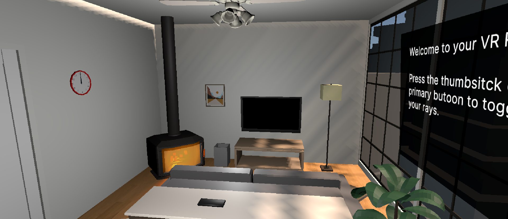
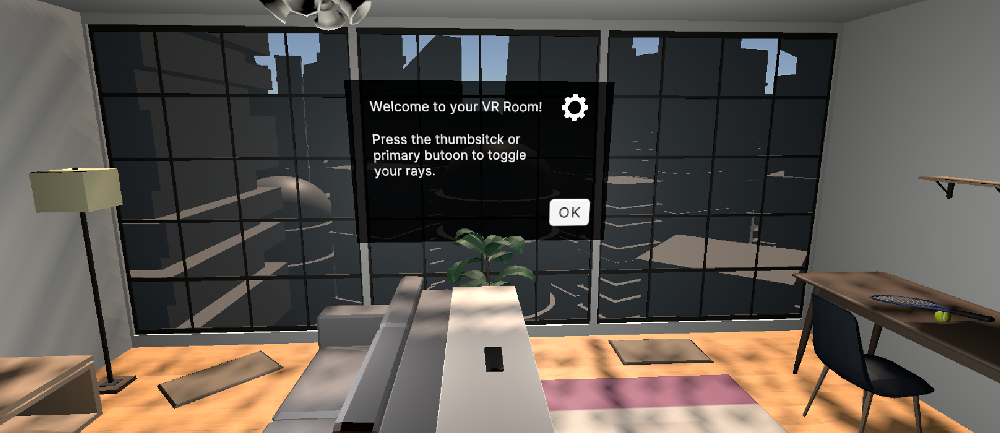
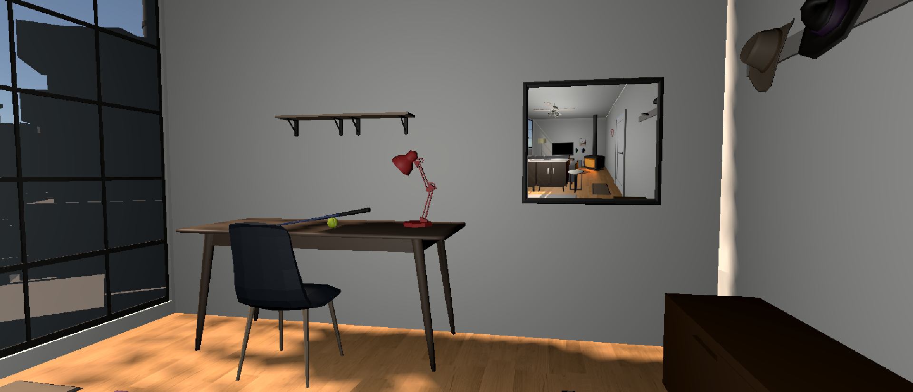

<div align="center">


[](https://unity.com)
[](https://www.khronos.org/openxr/)
[](https://docs.microsoft.com/en-us/dotnet/csharp/)
[](https://learn.unity.com/pathway/vr-development)

<br>

> *Built as part of the official Unity VR Development certification pathway.*
> *Focus: XR interaction fundamentals, VR locomotion, and immersive environment design.*

</div>

---

## Overview

An interactive VR room experience built in Unity using the XR Interaction Toolkit — featuring teleportation movement, object grabbing, physics-based interactions, and XR controller support. Developed as part of the **Unity VR Development** certification pathway to build foundational VR development skills.

---

## Screenshots

<div align="center">


&nbsp;


<br><br>



</div>

---

## Features

| | Feature |
|---|---|
| 🚶 | Teleportation movement system |
| ✋ | Grabbable objects with physics |
| 🎮 | Full XR controller support |
| 🖥️ | VR UI interaction system |
| 🏠 | Immersive room environment |
| ⚙️ | OpenXR cross-platform setup |

---

## Controls

<div align="center">

| Input | Action |
|:---:|:---|
| `Trigger Button` | Grab objects |
| `Thumbstick` | Teleport movement |
| `Controller Ray` | UI interaction |
| `VR Controllers` | Hand presence |

</div>

---

## Tech Stack

<div align="center">


</div>

---

## How to Run

```bash
# 1. Clone the repository
git clone https://github.com/SahilKakadiya2872/VR-Room-Sahil.git

# 2. Open Unity Hub and add the project folder

# 3. Open with Unity 2021 or newer

# 4. Enable XR Plugin Management in Project Settings

# 5. Connect a compatible VR headset

# 6. Open the main scene and press Play
```

---

## Project Structure

```
VR-Room-Sahil/
├── Assets/
│   ├── _Course Library/
│   ├── Challenges/
│   ├── Samples/
│   ├── Scenes/
│   ├── Settings/
│   ├── XR/
│   └── XRI/
├── Packages/
├── ProjectSettings/
├── Screenshots/
└── README.md
```

---

## What I Learned

| Area | Skills Gained |
|---|---|
| VR Fundamentals | XR Interaction Toolkit setup, OpenXR configuration |
| Locomotion | Teleportation system, movement boundaries |
| Interaction | Grab mechanics, physics-based object handling |
| UI | XR UI canvas, controller ray interaction |
| Optimisation | VR performance fundamentals, draw calls |

---

## Challenges & Solutions

| Challenge | Solution |
|---|---|
| XR interaction setup complexity | Followed Unity's official pathway step by step |
| Controller input configuration | Used Unity's new Input System with XR bindings |
| Natural grab behaviour | Tuned physics and attachment points iteratively |
| Teleportation boundary setup | Used Teleportation Area and Anchor components |

---

<div align="center">

**[← Back to Profile](https://github.com/SahilKakadiya2872)**
&nbsp;&nbsp;|&nbsp;&nbsp;
**[🌐 Portfolio](https://sahil-vr-portfolio.vercel.app)**
&nbsp;&nbsp;|&nbsp;&nbsp;
**[🎓 Unity VR Pathway](https://learn.unity.com/pathway/vr-development)**
&nbsp;&nbsp;|&nbsp;&nbsp;
**[🏅 View Certification](https://www.credly.com/go/5D76S9ZR)**


</div>
